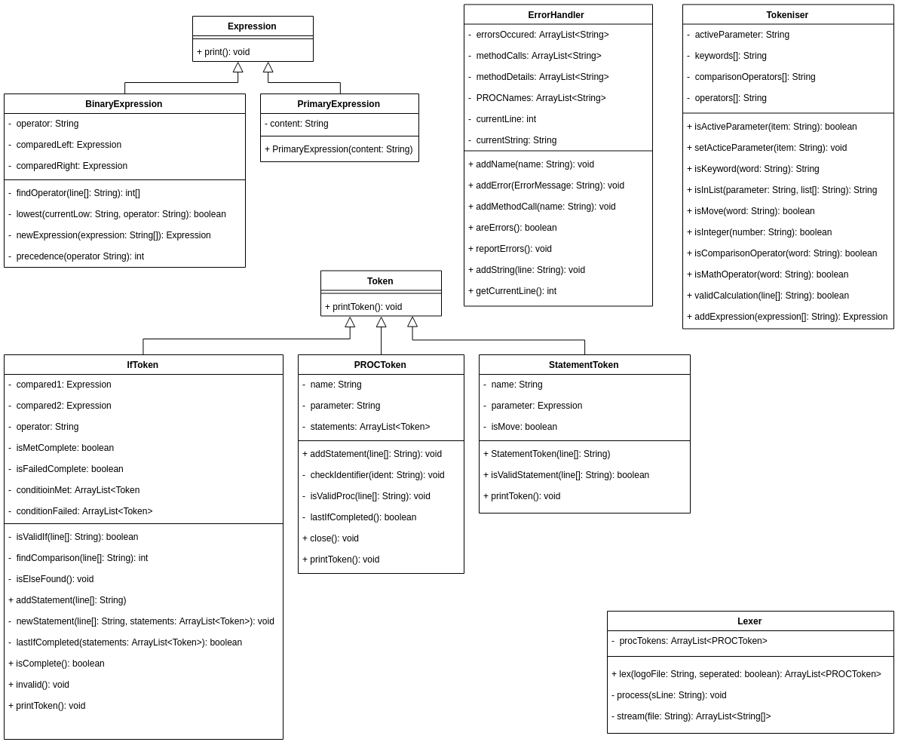
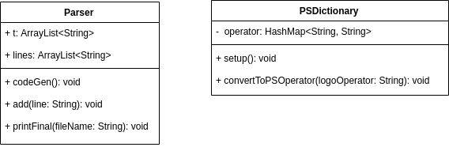
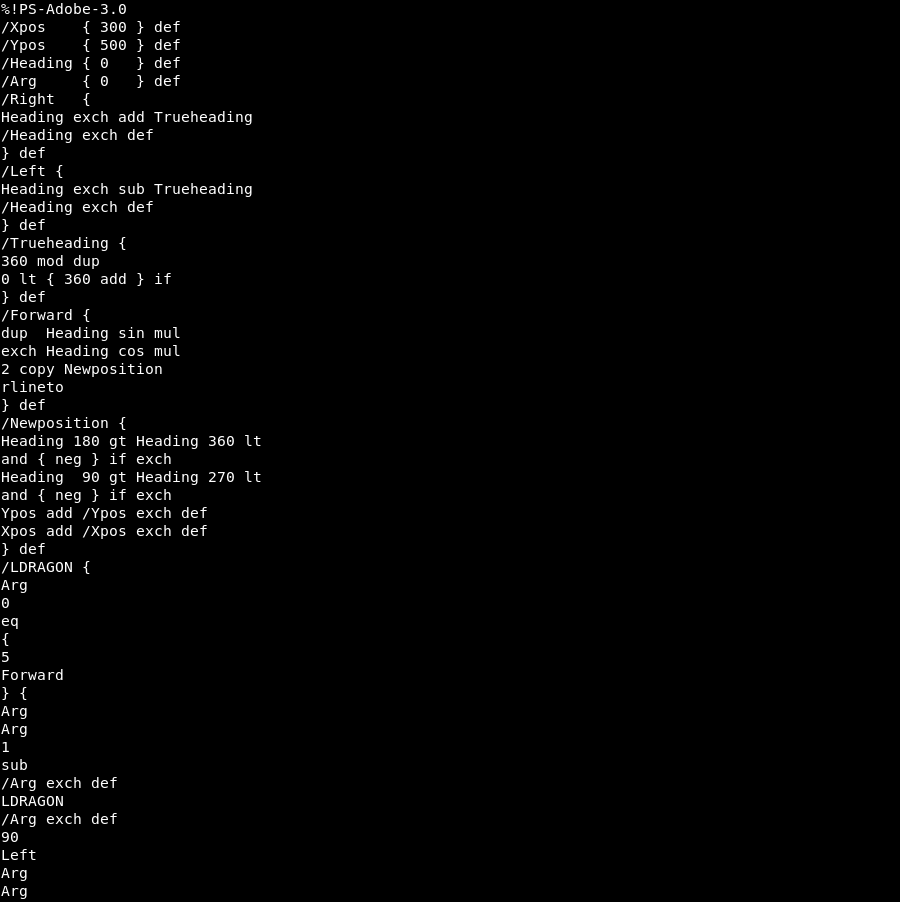
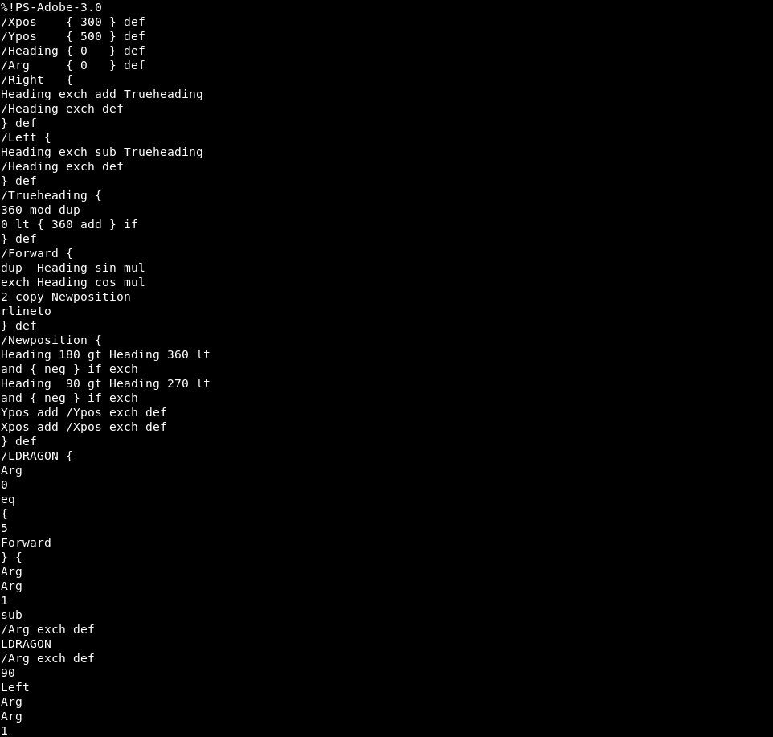
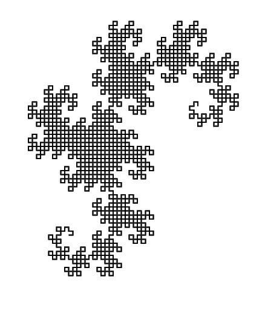
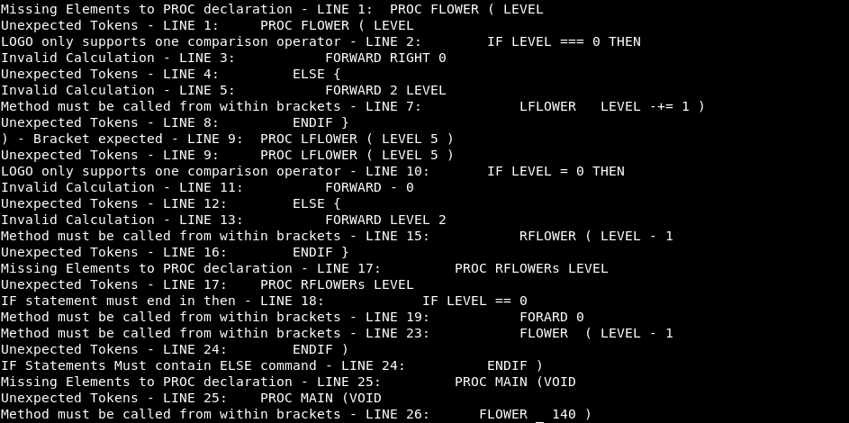
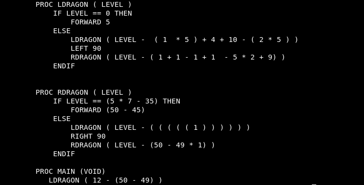

# Mini Compiler

## Overview

The specification required that a program be produced which is able to turn Logo programming language into postscript (`PS-Adobe-3.0`).  A document 

### Assumptions

Here are rules that were extrapolated from the provided Logo Grammar and examples of Logo Code.

1. Indentation is not important in the Logo language. This was extrapolated from `spiral.t`. So when parsing file indentation can be ignored, as it purposes are for convention only.
2. All commands must be separated by new lines.
3. All code in Logo language is ran inside of a `PROC` method. So the first word in any logo file must then be  `PROC`.
4. Parameters are always in circular brackets when declaring method and calling method in statement.
5. All Logo files have a `PROC MAIN (VOID)` from which where all the code executes.
6. All calculation expressions run in brackets. Extrapolated from examples.
7. Logo doesn't support complex comparison since it doesn't support any `and` or `or` operators. Logo can only support `{mathematical expression} comparison_op {mathematical expression}`. So If statements can only contain one comparison operator.
8. Methods cannot return values.
9. Logo only supports identifiers in the form `a-z` or `A-Z` . So Logo only support identifiers in consistent casing.
10. `IF` statements are types of statements and `IF` statements can contain statements therefore Logo must s
11. You cannot have multiple `PROC` methods with the same name. Just extrapolated from conventional programming.
12. Logo can only support `PROC` methods with one parameter.
13. Since declared by the logo grammar there are only two types of expressions: `primary` and `binary`. Primary expression are: `identifier`, `num` whereas binary expressions have the form: `expression op expression`. This there for means logo supports complex mathematical expressions such as following: `( 3 * 9 + 4 * 2 ) - ( 4 * 2 + 6 * 5) * 4`. Recursive structure as binary expressions can contain binary expressions.

### Problem Decomposition

The functionally In which the program requires has been split in to 3 separate sections. 

#### Lexical Analysis

Converts the Logo code to stream of `PROC` tokens. The `PROC` tokens contain the code which runs  the method with it. Each type of logo command shall be made into a type of `Token`. This section of code shall also be responsible for the checking for that the logo file has the correct syntax as well. The lexer shall also be able to parse a logo file in which all the commands have not been separated by new lines.

#### Parsing

Gets all the commands that are required to be printed to the file from all the tokens which have been created.

#### Code Generation

The steam of `PostScript` commands are printed to a `.ps` file with same name as inputted to program.

## Design

###### Binary Expression Tree

The binary expression tree is used to 'break down' expressions that are present in the given LOGO code. The operator with the lowest precedence is made the root of the tree. The number before this operator and the operator of next highest precedence are made children of the root operator. 

For example, if the expression was `(6 + 3 * 2)` the number '6' and the operator '+' would be made children of the root operator '*'. 

The number, in this case 6, is the primary expression. The operator is then made a new expression that 'searches' for the operator of next highest precedence, in this case '*'. From this either another operator is found or the two remaining numbers are made children of the operator and the end of the binary tree is reached.  


### Lexer




The following responsibilities:

* Syntax Checking.
* Determining If  `If statements` have been closed.
* identifier format checking.
* Check identifiers being used have been declared.
* `Tokenisation` of line.
* Binary Expression Tree Implementation.
* Determining if calculations are in the correct format.

It was determined

### Parser



## Testing

### Test Case 1:

The first test was used to ensure that the Mini-Compiler program successfully converts Logo code into a valid post script file. In this case we used the `dragon.ps` file. 

#### Expected Output

We expected a valid `.ps` file to be produced. When opened in a text editor it valid post script code should be shown. When opened in a file viewer a picture that represents a 'dragon' should be visible. 

#### Actual Output




As you can see from the above outputs, the program successfully produces a valid post script file and thus a picture/fractal of, in this case, a 'dragon'.

### Test Case 2:

This test was used to ensure that the Mini-Compiler could 'handle' Logo code if it was presented in a single line. 

 #### Expected 

The program should produce a valid `.ps` file and thus a picture/fractal of a dragon. 

#### Actual





The program successfully produces a valid `.ps` file and, in this case, a picture/fractal of a 'dragon'

### Test Case 3: 

This test case was used to ensure that the Mini-Compiler program handles errors, produces useful error information, including line numbers, 'recovers' from this error and continues to try and compile the rest of the program, providing further error information if applicable. 

#### Expected

The program should show multiple errors and their relevant information. For each error the following information should be shown: Description of the error, the line number where the error occurs and a 'copy' of the section around the error. 

#### Actual 



The program successfully displays errors and their relevant information as described above.  

### Test Case 4:

This test was used to ensure that the binary expression tree worked correctly. The `dragon.t` file was edited and used to perform this test. The following lines were altered: 

```PostScript
LDRAGON (LEVEL - 1 ) was replaced with 
LDRAGON ( LEVEL -  ( 1  * 5 ) + 4 + 10 - ( 2 * 5 ) )

RDRAGON ( LEVEL - 1 ) was replaced with
RDRAGON ( LEVEL - ( 1 + 1 - 1 + 1  - 5 * 2 + 9) )

LDRAGON ( LEVEL -1 ) was replaced with 
LDRAGON ( LEVEL - ( ( ( ( ( 1 ) ) ) ) ) )
```

#### Expected 

If the binary expression tree works correctly, the `.ps` file that the compiler produces should be the same as the file produced by the original `dragon.t` file

#### Actual 

Edited LOGO program with complex mathematical expressions:



Post Script produced by the 'Mini-Compiler':


Picture/Fractal produced by the 'Mini-Compiler'


As you can see. The fractal that the program produces is identical to that of the original`dragon.t` file. This shows that the binary expression tree works correctly. 

## Evaluation

The specification required that a LOGO to PostScript compiler be produced that correctly translates LOGO to PostScript. As you can see from the above tests one and two, our program successfully translates LOGO code to PostScript. The compiler makes use a single register (Arg) and utilises a stack. The program contains an error reporting system which produces useful error information when syntactically incorrect code is found. The program recovers from these errors and continue to parse the code until the end of the file as shown in the third test case.

## Conclusion


